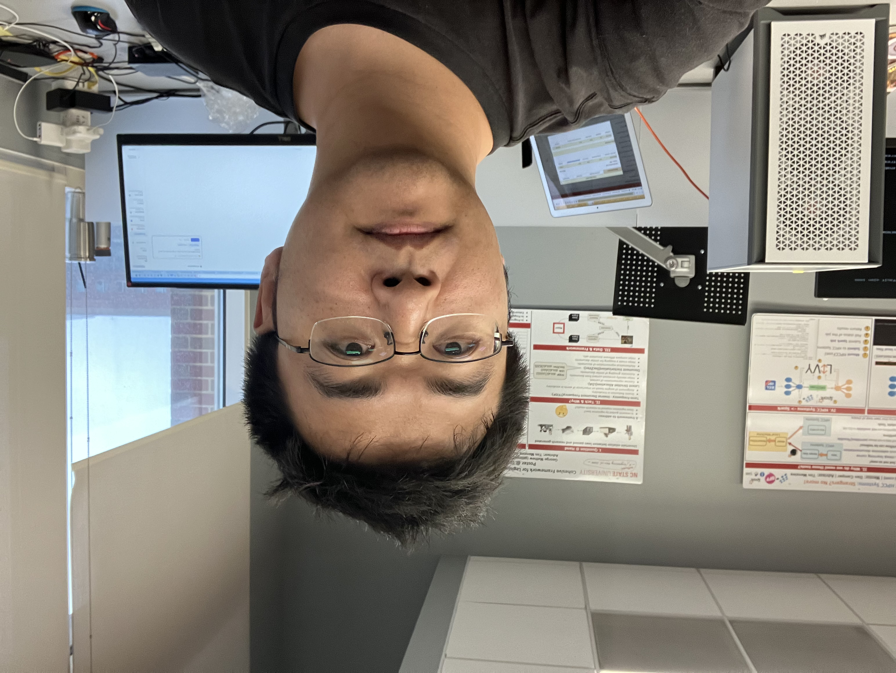

# Boyang Yan

- **Phone:** [+1 (984) 298-9873](tel:+19842989873) / [+86 18512290791](tel:+8618512290791) 
- **Email:** [yanboyang713@gmail.com](mailto:yanboyang713@gmail.com)  
- **Website:** [www.yanboyang.com](http://www.yanboyang.com)  
- **GitHub:** [yanboyang713](https://github.com/yanboyang713)  
- **LinkedIn:** [boyang-yan-50a70763](https://www.linkedin.com/in/boyang-yan-50a70763)

---

## Areas of Interest
- [Computer Networks](posts/2024-05-24-034608-networking)
- [Networked Systems](posts/2026-01-03-223923-networked_systems)
- [Anomaly Detection](posts/20230404190313-anomaly_detection)
- [Network Measurement](posts/2025-11-05-041036-network_measurement)
- [Cloud Computing](posts/2023-10-09-180437-cloud_computing)
- [Time Series Analysis](posts/20230404184340-time_series)
---

## Summary
My research interests spans computer networks and distributed systems, with an emphasis on [network measurement](posts/2025-11-05-041036-network_measurement), [anomaly detection](posts/20230404190313-anomaly_detection), [root-cause analysis](posts/2025-04-22-090350-root_cause_analysis), and [cloud computing](posts/2023-10-09-180437-cloud_computing). I develop data-driven methods to improve the cost-effectiveness, reliability, and performance of modern networked systems. My current work focuses on self-driving [cellular networks](posts/20230614221419-cellular_network), leveraging [small language models](posts/2025-11-04-233701-small_language_models_slms) and [time-series analysis](posts/20230404184340-time_series) for closed-loop monitoring and control.

I hold an M.S. in Statistics and Operations Research from [RMIT University (Royal Melbourne Institute of Technology)](https://www.rmit.edu.au/), Australia, and a B.S. in Computer Science from the [University of Wollongong](https://www.uow.edu.au/), Australia. I bring a strong background in network systems engineering, reinforced by hands-on experience in cloud infrastructure, [time-series analysis](posts/20230404184340-time_series), and [software-defined networking](posts/2025-04-10-011054-software_defined_networking_sdn). Before academia, I worked in industry, including with Microsoft Azure and at Peng Cheng Laboratory.

I’m passionate about exploring new technologies and methodologies and eager to tackle hard problems in uncharted territory.

---

## Education
### University of Virginia, Charlottesville, Virginia, USA
**Ph.D. in Computer Science** (Full-time)
*Aug, 2025 - Now*
- Coursework: AI Agent, Network Security, Serverless AI, Datacenter Network Infrastructure

### North Carolina State University, Raleigh, NC, USA
**Ph.D. in Computer Science (Non-degree)** (Full-time)
*Aug, 2023 - Nov, 2024*
- Coursework: Cloud Computing, Software Testing, Automated Software Engineering

**M.S. in Statistics (Exchange Student)** (Full-time)
*Aug, 2022 - Dec, 2022*
- Coursework: Fundamentals of Inference I, Advanced NextG Network Design, Cloud Computing

### Royal Melbourne Institute of Technology (RMIT), Melbourne, VIC, Australia
**M.S. in Statistics and Operations Research** (Full-time)
*Mar, 2021 - Dec, 2022*
- Coursework:
  - Optimization for Decision Making (linear optimization)
  - Multivariate Analysis
  - Data Visualization
  - Data Cleaning (Data Wrangling)
  - Time Series Analysis
  - Machine Learning
  - Applied Analytics
  - Statistical Computing

### University of Illinois Urbana-Champaign, Champaign County, Illinois, USA
**NetMath (Non-degree Courses)** (Part-time)
*Mar, 2018 - Jan, 2020*
- Coursework: Algebra, Preparation for Calculus

### University of Wollongong, Wollongong, NSW, Australia
**B.S. in Computer Science (Software Engineering)** (Full-time)
*Mar, 2014 - Dec, 2017*
- Coursework:
  - Object-Oriented Programming in C++
  - Algorithms and Data Structures
  - Database Systems
  - Systems Development
  - Software Development Methods & Tools

---

## Honors & Awards
- **2022**: Graduate with Distinction, RMIT University, Australia
- **2022**: SAS Advanced Analytics Certificate, SAS, Australia
- **2020**: Microsoft Hackathon Prize, Microsoft, China
- **2018**: Best Undergraduate Final Project Prize, University of Wollongong, Australia
- **2017**: Amateur Radio Operator’s Certificate of Proficiency (Standard), The Wireless Institute of Australia (WIA), Australia
- **2014, 2015**: Undergraduate Excellence Scholarship, University of Wollongong, Australia

---

## Employment
### **NC State University** | Raleigh, NC, USA 
**Teaching Assistant - Software Architectures for the Cloud (CSC495)(PART-TIME)** | Aug, 2024 – Nov, 2024
- Guided 21 undergraduate students and 2 master's students to independently complete projects on their chosen topics.
- Projects were divided into four parts: system design, implementation, security improvements, and deployment plans.
- Provided detailed feedback and assigned grades for each component of the projects.
- Achieved a high success rate, with 80% of students earning an A grade.

**Research Assistant - Data Science (Part-time)** | Aug, 2023 - Aug, 2024
- Developed statistical models and sampling techniques to improve data efficiency in resource-constrained environments.
- Enhanced classifier accuracy through oversampling algorithms (SMOTE, ADASYN, Borderline-SMOTE, SVM-SMOTE, and SMOTUNED) for optimizing distributed systems and large-scale networked applications.
  - Explored recursive projection techniques for clustering high-dimensional network data, with applications in anomaly detection and traffic classification.
  - Implemented advanced data processing pipelines to analyze network workload patterns and optimize performance.
  
**Research Assistant - Wireless Networks - J1 academic training (Full-time)** | Dec, 2022 - Aug, 2023
- Contributed to the Airpaws O-RAN testbed, focusing on scalable network deployment.
- Integrated and maintained OpenAirInterface (OAI) 7.2 RAN with Benetel 550 (RU) and OAI’s CU/DU.
- Developed and tested Aether Cloud Native 5G Core to improve reliability and performance in distributed environments.
- Designed orchestration and automation strategies to streamline deployment across diverse network topologies.
		
### **Microsoft** | Shanghai, China
**Support Engineer - Cloud Solutions (Fully-time)** | Mar, 2020 - Jun, 2021
- Resolved complex network infrastructure challenges for enterprise customers using cloud-based solutions.
- Led troubleshooting and performance optimization efforts for cloud networking and large-scale distributed systems.
- Designed deployment strategies for cloud-native applications, ensuring robust, scalable architectures.
- Provided in-depth technical support for enterprise networking, including transport protocols, hybrid cloud integration, and containerized workloads.
- **Manager:** Kenji Hamada (Data & AI Pod)

### **Peng Cheng Laboratory** | Shenzhen, China
**Algorithm Engineer - Computer Networks (Full-time)** | Dec, 2018 - Mar, 2020
- Designed a high-performance networking simulator to optimize resource allocation in distributed environments.
- Implemented and maintained Network Function Virtualization (NFV) infrastructure to enhance network efficiency.
- Developed a robust configuration management framework, improving operational reliability and reducing downtime. Achieved: One patent
- Designed a communication framework for wireless networks, optimizing routing and information exchange in dynamic environments.
- **Manager:** Jingpu Duan (Network Communications Research Center)

### **University of Wollongong** | Wollongong, NSW, Australia
**Research Assistant - Software Engineering (Fully-time)** | Jan, 2018 - Nov, 2018
- Researched Natural Language Processing (NLP) with a focus on developing innovative failure testing methodologies for Machine Translation systems, utilizing Metamorphic Testing principles to enhance automation and failure detection capabilities.
- Designed and implemented a comprehensive data processing pipeline, significantly improving the efficiency and traceability of the experimental research process.
- Developed a Big Data analysis engine tailored for the in-depth analysis of experimental results.
- **Advisor:** Dr. George Zhou (Software Testing Lab)

---
## Skills

### Programming Languages
- [C/C++](posts/20230608221530-c)
- [Rust](posts/20230220230005-rust)
- [Python](posts/20230404161934-python)
- [R](posts/20230622162146-r_language)
- SAS  
- Lisp  
- Bash Scripting  

### Databases  
- Relational Databases: [PostgreSQL](posts/20230220215653-postgre), MySQL, Oracle
- NoSQL: MongoDB  
- Key-Value Stores: [Redis](posts/2023-10-12-235342-redis)

### Operating Systems
- [Arch Linux](posts/20230220222636-arch_linux)
- [Ubuntu](posts/20230220222545-ubuntu)
- [Debian](posts/20230228044717-debian)

### Computer Networks/Cloud
- Cloud Platforms: [Azure](posts/20230328005951-azure), [AWS](posts/20230314144515-aws)
- Openshift ([Kubernetes](posts/20230105185343-kubernetes))
- [Open vSwitch (OVS)](posts/2023-12-06-170847-open_vswitch_ovs)
- P4 (Programming Protocol-Independent Packet Processors)
- Transport Protocols: [REST APIs](posts/20230620161819-restful), TCP/IP, [gRPC](posts/2023-11-07-011240-grpc)

### Tools/Frameworks  
- Network Simulation: [NS3](posts/20230105183742-ns3)
- Version Control: [Git](posts/20230220223747-git)
- Configuration Management: [Ansible](posts/2023-10-30-025244-ansible)
- Infrastructure as Code (IaC): [Terraform](posts/2024-01-27-072055-terraform)

---

## Publications

### Fault-Tolerant Sandboxing for AI Coding Agents: A Transactional Approach to Safe Autonomous Execution
**arXiv preprint, 2025**
- Proposed a “middle-ground” sandboxing design for headless autonomous agents by treating each tool-call as an atomic transaction with explicit prepare/commit/rollback semantics.
- Implemented a policy-based interception layer plus filesystem snapshot/rollback to block unsafe commands and recover from failed tool executions (state consistency guarantees).
- Deployed and evaluated on my [data center testbed](posts/2025-04-10-010004-data_center_testbed_design) with EVPN/VXLAN isolation (VyOS VTEPs), separating the agent (LXC) from the inference server (GPU VM).
- Demonstrated 100`%` interception and 100`%` rollback success, with only ~14.5`%` (~1.8s) per-transaction overhead using Minimind-v1-MoE served via nano-vllm.

### Workload Prediction in P4 Programmable Switches
**arXiv preprint, 2024**
- Revised the decision tree (DT) to the Recursive Random Projection Regression (Kind of Binary Decision Tree - Own method), supports faster training, generates fewer rules and satisfies switch constraints better
- Conducted comprehensive comparisons among six Hyperparameter Search methods (Random Search, Grid Search, Bayesian Optimization, Genetic Algorithms - using TPOT, SHERPA, and Optuna) to optimize my own Regression method
- Benchmarked the Recursive Random Projection Regression against seven baselines (Vector Auto Regression, Support Vector Machines, Random Forest Regressor, Gradient Boosting Machine, Large Bayesian vector auto regression, explainable Boosted Linear Regression, and distribution enhanced linear regression), which demonstrated superior performance, particularly in scenarios involving P4 switches.

---

### MLOps in a Multi-cloud Environment: Typical Network Topology  
**arXiv preprint, 2024**  
- Designed and implemented a robust MLOps pipeline capable of seamless integration across multiple cloud platforms, including Azure, Google Cloud, AWS, and Corewave. This pipeline facilitated secure, efficient deployment and operation of machine learning models, ensuring consistency and reliability across diverse cloud infrastructures.
- Architected a comprehensive infrastructure that supports the entire lifecycle of machine learning models, from data collection to real-time model inference, which advanced data management strategies to optimize the storage, retrieval, and processing of large datasets, crucial for maintaining the accuracy and efficiency of deployed models.
- Tackled critical challenges in maintaining high availability and scalability of machine learning services in a multi-cloud environment. Implemented strategies to ensure that models remained available and performant under varying load conditions.
- Conducted an in-depth analysis of both business and technical requirements to inform the selection of cloud service providers. The result was a strategically optimized deployment environment that balanced cost, performance, and security considerations.

---

### MetaDetect: Metamorphic Testing-Based Anomaly Detection for Multi-UAV Wireless Networks  
**arXiv preprint, 2023**  
- Developed advanced methods for predicting anomalies in wireless network data, utilizing time-series analysis. This approach was applied to nine distinct wireless network metrics and various UAV sensor data, enabling precise detection and characterization of anomalies within wireless networks.
- Main contributions:
  + Ensured that the anomaly detection models provided clear and understandable explanations for their predictions, enhancing the interpretability of the results.
  + Designed to operate without relying on physical environmental data, making the system robust and adaptable to various operational contexts.
  + Implemented automated systems capable of identifying incidents and accident events in real-time. This feature significantly improved the responsiveness and efficiency of monitoring systems, facilitating quick actions in response to detected anomalies.

---

### Metamorphic Relations for Data Validation: A Case Study of Translated Text Messages  
**The 41st International Conference on Software Engineering (ICSE MET Workshop), 2019**  
- Expansion of Metamorphic Testing for Data Validation: Advanced the use of metamorphic testing techniques to assess the quality and integrity of input data in software programs. This approach was particularly focused on scenarios where source or follow-up inputs might be improperly generated, ensuring the robustness of data processing systems.
- Conducted an in-depth case study within the NLP domain, specifically addressing the unique challenges associated with the machine translation of text messages. The study focused on translations between Chinese and English, highlighting common pitfalls and inconsistencies in automated translation outputs.
- Demonstrated the utility of metamorphic relations (MR) in automatically detecting poor-quality translations. This method provided a reliable means of identifying issues in translated texts without relying on reference translations, thus streamlining the validation process.
- Engineered a sophisticated crawler system to automate the collection of test datasets from various sources, including Wikipedia Context, Google Translate, Microsoft Translator, and Youdao Translate. This system facilitated the creation of a comprehensive set of test cases, crucial for evaluating and improving the quality of machine translation systems.

---

## Patents

**Automated text difference analysis and verification system/method, 2020**
- China Patent Office ID: CN202010489931.8
- Area: Network Configuration File Update
  + Conceptualized and spearheaded the development of an automated system for text difference analysis and verification, specifically targeting the complexities associated with network configuration file updates.
  + Designed a groundbreaking approach for autonomously generating test cases based on the internal attribute relationships, enhancing the efficiency and accuracy of differential analysis tools and contributing to more reliable network configuration management practices.
  + Engineered a pioneering method to automatically generate test cases by leveraging internal attribute relationships within the data. This innovation significantly improved the efficiency and precision of differential analysis tools, ensuring more accurate detection and verification of changes.

## Projects

**Meta Scientific Linux** | Personal Project (2022 – Ongoing)  
- Created a Linux distribution tailored for researchers using Arch Linux.  

**Highway Traffic Anomaly Analysis** | University Research Project (2022)  
- Developed visualization techniques for highway traffic data.

**Custom Ergonomic Keyboard** | Personal Project (2024 – Ongoing)  
- Designed a split ergonomic keyboard with voice input support.

---
